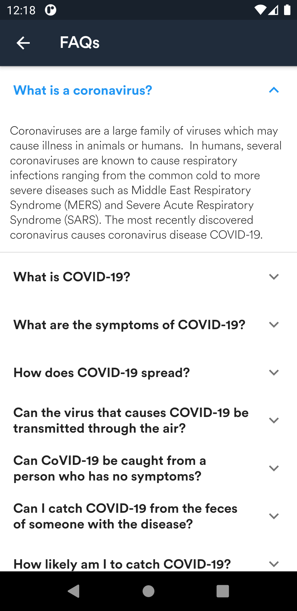

# Covid-19_Tracker
Covid tracker is a flutter application which help us to track the covid conditon in our area.

#### Features:
1. You can find the most affected country by covid and their statistics.
2. You can also track country wise.
3. Dark and light mode.

<table>
  <tr>
    <td>Home Page</td>
     <td>Search Page</td>
     <td>FAQs</td>
  </tr>
  <tr>
    <td></td>
    <td></td>
    <td></td>
  </tr>
 </table>

## Getting Started

This project is a starting point for a Flutter application.

A few resources to get you started if this is your first Flutter project:

- [Lab: Write your first Flutter app](https://flutter.dev/docs/get-started/codelab)
- [Cookbook: Useful Flutter samples](https://flutter.dev/docs/cookbook)

For help getting started with Flutter, view our
[online documentation](https://flutter.dev/docs), which offers tutorials,
samples, guidance on mobile development, and a full API reference.
